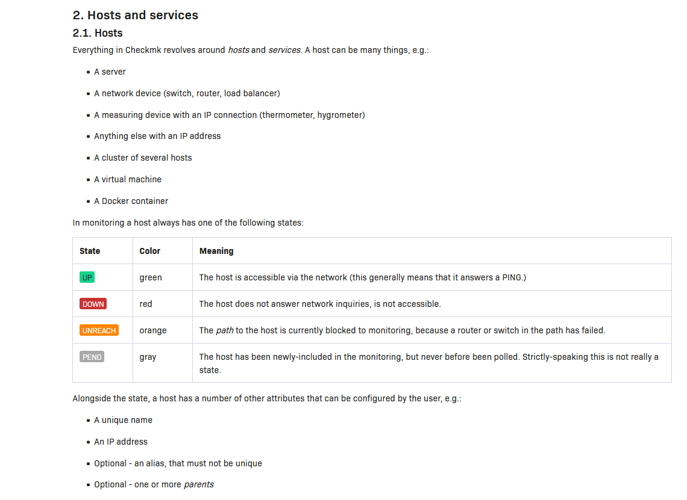
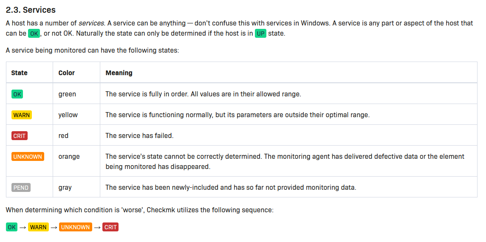

# 📑 Requirements for Log Hopper

## Zabbix Requirements

### ✅ Core Requirements

### 1. Log Gathering Agents
- Provide **client-side agents** or **API integrations** capable of collecting logs from multiple systems and services.
- Agents must support:
  - Configurable **log sources**
  - Configurable **log delivery intervals**
  - Secure transmission to the Log Hopper backend via REST or GraphQL API.

---

### 2. Log Analysis & Processing
- The system must be capable of **analyzing incoming logs** for:
  - Log levels (info, warning, error, etc.)
  - Keywords or pattern matching (regex support)
  - Source system identifiers
  - Timestamps and time ranges.

---

### 3. Log Filtering via Rules
- Enable **rule-based filtering** of logs, where users can:
  - Define **permanent or temporary filters**
  - Set filters by log level, source, pattern, or other fields
  - Combine multiple conditions using **AND/OR logic**
- Filtered logs must be:
  - Stored in a database
  - Optionally forwarded to connected services (**Checkmk**, **Zabbix**, **Prometheus**) in a compatible format.

---

## CheckMK Requirements
### ✅ Core Requirements

### 1. Status Monitoring 
- Provide **client-side agents** or **API integrations** capable of collecting sytem info / health from multiple systems and services.
- Agents must support:
  - Configurable **Wich state equls waht service**
  see image Below for more info
  
  
  - Configurable **delivery intervals**
  - Secure transmission to the Log Hopper backend via REST or GraphQL API.
---

## prometheus

### ✅ Core Requirements

### 1. Status Monitoring 
- Provide **client-side agents** or **API integrations** capable of collecting sytem info / health from multiple systems and services.
- Agents must support:
  - Configurable choice of wich metric for data is supose to be gahterd.
      - Counter
      - Gauge
      - Histogram
      - Summary
  - Configurable **delivery intervals**
  - Secure transmission to the Log Hopper backend via REST or GraphQL API.
---

## Non system spesific requirements
###  User Interface & Account Management
- Provide a **web-based UI** to:
  - Display incoming logs and filtered results
  - Create, edit, and manage log filter rules
  - View system status and integration settings
- Include **User Authentication and Authorization**
  - Allow users to register and log in
  - Manage individual user accounts and saved configurations
  - Enforce access control for logs and rule management.

---